# 📐 Diagram Sistem - myITS Merchandise

Dokumen ini berisi diagram-diagram teknis sistem yang dapat di-render dengan Mermaid.

---

## 1. Use Case Diagram

```mermaid
flowchart TB
    subgraph System["🛒 myITS Merchandise System"]
        UC1[Browse Katalog]
        UC2[Cari Produk]
        UC3[Lihat Detail Produk]
        UC4[Tambah ke Keranjang]
        UC5[Checkout]
        UC6[Bayar Pesanan]
        UC7[Lihat Riwayat Transaksi]
        UC8[Download Invoice]
        UC9[Apply Kupon]
        UC10[Kelola Alamat]
        UC11[Register/Login]
        
        UC20[Kelola Produk]
        UC21[Kelola Pesanan]
        UC22[Input Resi]
        UC23[Kelola Kupon]
        UC24[Lihat Dashboard]
    end
    
    Customer((👤 Customer))
    Admin((👨‍💼 Admin))
    
    Customer --> UC1
    Customer --> UC2
    Customer --> UC3
    Customer --> UC4
    Customer --> UC5
    Customer --> UC6
    Customer --> UC7
    Customer --> UC8
    Customer --> UC9
    Customer --> UC10
    Customer --> UC11
    
    Admin --> UC20
    Admin --> UC21
    Admin --> UC22
    Admin --> UC23
    Admin --> UC24
```

---

## 2. Activity Diagram - Proses Pembelian

---

## 3. Sequence Diagram - Checkout Flow

---

## 4. Class Diagram (Simplified)

---

## 5. State Diagram - Order Status

---

## 6. Component Diagram

---

## 7. Deployment Diagram

---

## 8. Data Flow Diagram (Level 0)

---

**Catatan:** Diagram-diagram di atas menggunakan format Mermaid dan dapat di-render di:
- GitHub
- VS Code (dengan ekstensi Markdown Preview Mermaid)
- Mermaid Live Editor (https://mermaid.live)
