# 📋 Laporan Proyek: myITS Merchandise

## Dokumentasi Lengkap Sistem E-Commerce

---

# 📑 Daftar Isi

1. [Ringkasan Eksekutif](#ringkasan-eksekutif)
2. [Deskripsi Proyek](#deskripsi-proyek)
3. [Teknologi yang Digunakan](#teknologi-yang-digunakan)
4. [Arsitektur Sistem](#arsitektur-sistem)
5. [Diagram Database](#diagram-database)
6. [Diagram Alur Sistem](#diagram-alur-sistem)
7. [Struktur Direktori](#struktur-direktori)
8. [Fitur Aplikasi](#fitur-aplikasi)
9. [API Endpoints](#api-endpoints)
10. [Panduan Pengguna](#panduan-pengguna)
11. [Panduan Administrator](#panduan-administrator)
12. [Panduan Instalasi](#panduan-instalasi)
13. [Keamanan](#keamanan)
14. [Kesimpulan](#kesimpulan)

---

# Ringkasan Eksekutif

**myITS Merchandise** adalah platform e-commerce berbasis web yang dikembangkan untuk Institut Teknologi Sepuluh Nopember (ITS) Surabaya. Platform ini memungkinkan mahasiswa, alumni, dan masyarakat umum untuk membeli merchandise resmi ITS secara online dengan fitur lengkap termasuk:

- Katalog produk dengan kategori dan varian
- Keranjang belanja terintegrasi
- Sistem pembayaran online via Midtrans
- Kalkulasi ongkos kirim otomatis via RajaOngkir
- Sistem kupon diskon
- Invoice otomatis
- Dashboard admin untuk pengelolaan

---

# Deskripsi Proyek

## Latar Belakang

Proyek ini dikembangkan untuk memenuhi kebutuhan penjualan merchandise ITS secara digital, menggantikan sistem penjualan konvensional yang kurang efisien.

## Tujuan

1. Menyediakan platform e-commerce yang modern dan user-friendly
2. Mengotomasi proses pemesanan, pembayaran, dan pengiriman
3. Memberikan pengalaman berbelanja yang seamless bagi pengguna
4. Menyediakan dashboard admin untuk monitoring dan pengelolaan

## Ruang Lingkup

| Aspek | Deskripsi |
|-------|-----------|
| Target Pengguna | Mahasiswa, Alumni, Staff ITS, Masyarakat Umum |
| Jenis Produk | Pakaian, Aksesoris, Alat Tulis, Merchandise ITS |
| Area Pengiriman | Seluruh Indonesia (via JNE, POS, TIKI) |
| Metode Pembayaran | Transfer Bank, E-Wallet, QRIS, Virtual Account |

---

# Teknologi yang Digunakan

## Frontend
| Teknologi | Versi | Penggunaan |
|-----------|-------|------------|
| HTML5 | - | Struktur halaman |
| CSS3 | - | Styling dan animasi |
| JavaScript | ES6+ | Logika frontend |
| Bootstrap | 5.3.2 | UI Framework |
| Bootstrap Icons | 1.11.1 | Ikon |
| AOS | 2.3.1 | Animasi scroll |

## Backend
| Teknologi | Versi | Penggunaan |
|-----------|-------|------------|
| PHP | 8.x | Server-side logic |
| MySQL | 8.x | Database |
| MySQLi & PDO | - | Database driver |

## Integrasi Pihak Ketiga
| Layanan | Fungsi |
|---------|--------|
| Midtrans | Payment Gateway |
| RajaOngkir | Kalkulasi Ongkos Kirim |

## Tools & Environment
| Tool | Penggunaan |
|------|------------|
| XAMPP | Local development server |
| Git | Version control |
| GitHub | Remote repository |

---

# Arsitektur Sistem

## Diagram Arsitektur Umum

```mermaid
flowchart TB
    subgraph Client["🖥️ Client Browser"]
        HTML["HTML/CSS/JS"]
        Bootstrap["Bootstrap 5"]
    end
    
    subgraph Server["🌐 Web Server (Apache)"]
        PHP["PHP 8.x"]
        API["REST API Endpoints"]
    end
    
    subgraph Database["🗄️ Database"]
        MySQL["MySQL 8.x"]
    end
    
    subgraph External["🔗 External Services"]
        Midtrans["Midtrans API"]
        RajaOngkir["RajaOngkir API"]
    end
    
    Client <--> Server
    Server <--> Database
    Server <--> External
```



## Diagram Komponen Sistem


---

# Diagram Database

## Entity Relationship Diagram (ERD)


## Daftar Tabel Database

| No | Nama Tabel | Deskripsi |
|----|------------|-----------|
| 1 | users | Data pengguna |
| 2 | products | Data produk |
| 3 | categories | Kategori produk |
| 4 | product_variants | Varian produk (ukuran/warna) |
| 5 | size_options | Opsi ukuran |
| 6 | color_options | Opsi warna |
| 7 | product_images | Galeri gambar produk |
| 8 | orders | Data pesanan |
| 9 | order_details | Detail item pesanan |
| 10 | cart | Keranjang belanja |
| 11 | addresses | Alamat pengiriman |
| 12 | coupons | Data kupon diskon |
| 13 | coupon_usages | Riwayat penggunaan kupon |
| 14 | wishlist | Produk favorit |
| 15 | reviews | Ulasan produk |
| 16 | notifications | Notifikasi pengguna |

---

# Diagram Alur Sistem

## Alur Pemesanan (Order Flow)

```mermaid
flowchart TD
    A[👤 User Browse Katalog] --> B[🛒 Tambah ke Keranjang]
    B --> C[📋 Lihat Keranjang]
    C --> D{Login?}
    D -->|Belum| E[🔐 Login/Register]
    E --> D
    D -->|Sudah| F[📍 Pilih Alamat Pengiriman]
    F --> G[🚚 Pilih Kurir & Lihat Ongkir]
    G --> H{Punya Kupon?}
    H -->|Ya| I[🎫 Apply Kupon]
    I --> J[💰 Lihat Total]
    H -->|Tidak| J
    J --> K[💳 Bayar via Midtrans]
    K --> L{Pembayaran Berhasil?}
    L -->|Ya| M[✅ Pesanan Diproses]
    L -->|Tidak| N[❌ Pembayaran Gagal]
    M --> O[📦 Admin Kemas Pesanan]
    O --> P[🚚 Admin Input Resi]
    P --> Q[📬 Pesanan Dikirim]
    Q --> R[✅ Pesanan Selesai]
```



## Alur Pembayaran (Payment Flow)


## Alur Admin Mengelola Pesanan

```mermaid
flowchart LR
    A[📋 Dashboard Admin] --> B[Lihat Pesanan Masuk]
    B --> C{Status Pesanan}
    C -->|Belum Bayar| D[⏳ Tunggu Pembayaran]
    C -->|Sudah Bayar| E[📦 Kemas Pesanan]
    E --> F[✏️ Input No. Resi]
    F --> G[🚚 Status: Dikirim]
    G --> H[✅ Selesaikan Pesanan]
```



---

# Struktur Direktori

```
its-merch-bootstrap/
├── 📁 src/
│   ├── 📁 api/                    # Backend API endpoints
│   │   ├── db.php                 # Database connection
│   │   ├── midtrans_config.php    # Midtrans configuration
│   │   ├── rajaongkir_config.php  # RajaOngkir configuration
│   │   ├── get_products.php       # Products API
│   │   ├── cart.php               # Cart management
│   │   ├── checkout.php           # Order processing
│   │   ├── coupons.php            # Coupon system
│   │   ├── invoice.php            # Invoice generator
│   │   └── ... (40+ API files)
│   │
│   ├── 📁 assets/
│   │   ├── 📁 images/             # Static images
│   │   └── 📁 css/                # Stylesheets
│   │
│   ├── 📁 js/
│   │   └── app.js                 # Main JavaScript logic
│   │
│   ├── 📁 css/
│   │   └── styles.css             # Custom styles
│   │
│   ├── index.html                 # Homepage
│   ├── catalog.html               # Product catalog
│   ├── product.html               # Product detail
│   ├── checkout.html              # Checkout page
│   ├── transactions.html          # Order history
│   ├── admin.html                 # Admin dashboard
│   ├── orders.html                # Order management
│   └── coupons-admin.html         # Coupon management
│
├── 📄 complete_database_reset.sql # Full database schema
├── 📄 README.md                   # Project readme
├── 📄 .gitignore                  # Git ignore rules
└── 📄 DOKUMENTASI.md              # This file
```

---

# Fitur Aplikasi

## Fitur Pengguna (Customer)

| No | Fitur | Deskripsi |
|----|-------|-----------|
| 1 | 🔐 Registrasi & Login | Buat akun dan masuk ke sistem |
| 2 | 📦 Katalog Produk | Lihat semua produk dengan filter kategori |
| 3 | 🔍 Pencarian | Cari produk berdasarkan nama |
| 4 | 📱 Detail Produk | Lihat deskripsi, harga, stok, dan varian |
| 5 | 🛒 Keranjang Belanja | Tambah, ubah, hapus item di keranjang |
| 6 | 📍 Manajemen Alamat | Simpan multiple alamat pengiriman |
| 7 | 🚚 Cek Ongkos Kirim | Hitung ongkir real-time via RajaOngkir |
| 8 | 🎫 Kupon Diskon | Apply kode kupon untuk potongan harga |
| 9 | 💳 Pembayaran Online | Bayar via Midtrans (Bank, E-Wallet, QRIS) |
| 10 | 📋 Riwayat Transaksi | Lihat semua pesanan dan statusnya |
| 11 | 🧾 Download Invoice | Cetak invoice PDF untuk pesanan selesai |
| 12 | ❤️ Wishlist | Simpan produk favorit |
| 13 | ⭐ Review Produk | Berikan ulasan dan rating |

## Fitur Administrator

| No | Fitur | Deskripsi |
|----|-------|-----------|
| 1 | 📊 Sales Dashboard | Statistik penjualan dan revenue |
| 2 | 📦 Kelola Produk | Tambah, edit, hapus produk |
| 3 | 🏷️ Kelola Kategori | Atur kategori produk |
| 4 | 📋 Kelola Pesanan | Proses dan update status pesanan |
| 5 | 🚚 Input Resi | Masukkan nomor resi pengiriman |
| 6 | 🎫 Kelola Kupon | Buat dan atur kupon diskon |
| 7 | 📸 Upload Gambar | Upload gambar produk langsung |

---

# API Endpoints

## Authentication

| Method | Endpoint | Deskripsi |
|--------|----------|-----------|
| POST | `/api/register.php` | Registrasi user baru |
| POST | `/api/login.php` | Login user |

## Products

| Method | Endpoint | Deskripsi |
|--------|----------|-----------|
| GET | `/api/get_products.php` | Ambil semua produk |
| GET | `/api/get_products.php?id=1` | Ambil detail produk |
| GET | `/api/get_categories.php` | Ambil semua kategori |
| POST | `/api/admin_add_product.php` | Tambah produk (Admin) |
| POST | `/api/admin_update_product.php` | Update produk (Admin) |
| POST | `/api/admin_delete_product.php` | Hapus produk (Admin) |

## Cart

| Method | Endpoint | Deskripsi |
|--------|----------|-----------|
| GET | `/api/cart.php?user_id=1` | Ambil isi keranjang |
| POST | `/api/cart.php` | Tambah item ke keranjang |
| PUT | `/api/cart.php` | Update quantity |
| DELETE | `/api/cart.php?id=1` | Hapus item dari keranjang |

## Orders

| Method | Endpoint | Deskripsi |
|--------|----------|-----------|
| GET | `/api/get_orders.php?user_id=1` | Ambil pesanan user |
| GET | `/api/get_orders.php?admin=1` | Ambil semua pesanan (Admin) |
| POST | `/api/checkout.php` | Buat pesanan baru |
| POST | `/api/update_order_status.php` | Update status pesanan |
| POST | `/api/update_payment_status.php` | Update status pembayaran |

## Shipping

| Method | Endpoint | Deskripsi |
|--------|----------|-----------|
| GET | `/api/get_provinces.php` | Ambil daftar provinsi |
| GET | `/api/get_cities.php?province_id=1` | Ambil daftar kota |
| GET | `/api/get_districts.php?city_id=1` | Ambil daftar kecamatan |
| GET | `/api/search_destination.php?q=surabaya` | Cari destinasi |
| POST | `/api/get_shipping_cost.php` | Hitung ongkos kirim |

## Coupons

| Method | Endpoint | Deskripsi |
|--------|----------|-----------|
| GET | `/api/coupons.php?code=XXX&user_id=1&subtotal=100000` | Validasi kupon |
| GET | `/api/coupons.php?all=1` | Ambil semua kupon (Admin) |
| POST | `/api/coupons.php` | Buat kupon baru (Admin) |
| PUT | `/api/coupons.php` | Update kupon (Admin) |
| DELETE | `/api/coupons.php?id=1` | Hapus kupon (Admin) |

---

# Panduan Pengguna

## 1. Registrasi dan Login

### Registrasi
1. Buka halaman utama `index.html`
2. Klik **"Login"** di sidebar
3. Klik link **"Daftar"** di bawah form login
4. Isi nama, email, dan password
5. Klik **"Daftar Sekarang"**

### Login
1. Klik **"Login"** di sidebar
2. Masukkan email dan password
3. Klik **"Masuk Sekarang"**

## 2. Berbelanja

### Melihat Produk
1. Buka halaman **Katalog**
2. Gunakan filter kategori untuk menyaring produk
3. Gunakan kotak pencarian untuk mencari produk spesifik
4. Klik produk untuk melihat detail

### Menambah ke Keranjang
1. Di halaman detail produk, pilih varian (jika ada)
2. Klik tombol **"Tambah ke Keranjang"**
3. Produk akan masuk ke keranjang

### Checkout
1. Buka keranjang dengan klik ikon 🛒
2. Periksa item dan quantity
3. Klik **"Checkout Sekarang"**
4. Pilih atau tambah alamat pengiriman
5. Pilih kurir (JNE/POS/TIKI)
6. Masukkan kode kupon jika ada
7. Klik **"Bayar Sekarang"**
8. Pilih metode pembayaran di popup Midtrans
9. Selesaikan pembayaran

## 3. Melihat Pesanan

1. Buka menu **Transaksi Saya**
2. Lihat daftar semua pesanan
3. Filter berdasarkan status (Belum Bayar, Dikemas, Dikirim, Selesai)
4. Klik **"Detail"** untuk melihat rincian pesanan
5. Klik **"Invoice"** untuk download PDF (pesanan selesai)

---

# Panduan Administrator

## 1. Login sebagai Admin

1. Login dengan akun yang memiliki role `admin`
2. Sidebar akan berubah menampilkan menu admin

## 2. Dashboard Sales

1. Buka menu **Sales Dashboard**
2. Lihat statistik:
   - Total Penjualan
   - Produk Terjual
   - Total Pelanggan
   - Pending Revenue

## 3. Mengelola Produk

### Tambah Produk
1. Buka **Katalog Produk**
2. Klik tombol **"Tambah Produk"**
3. Isi form:
   - Nama produk
   - Kategori
   - Deskripsi
   - Harga
   - Stok
   - Gambar (URL atau Upload)
   - Varian (opsional)
4. Klik **"Simpan Produk"**

### Edit/Hapus Produk
1. Di katalog, klik **"Edit"** atau **"Hapus"** pada produk
2. Update informasi yang diperlukan
3. Simpan perubahan

## 4. Mengelola Pesanan

1. Buka menu **Kelola Pesanan**
2. Lihat pesanan berdasarkan status
3. Untuk pesanan "Dikemas":
   - Klik **"Kirim"**
   - Masukkan nomor resi
   - Klik **"Kirim Pesanan"**
4. Untuk pesanan "Dikirim":
   - Klik **"Selesaikan"** setelah konfirmasi

## 5. Mengelola Kupon

1. Buka menu **Kelola Kupon**
2. Klik **"+ Kupon Baru"** untuk membuat kupon
3. Isi detail kupon:
   - Kode kupon
   - Tipe diskon (persentase/nominal)
   - Nilai diskon
   - Minimum pembelian
   - Batas penggunaan
   - Periode berlaku
4. Simpan kupon

---

# Panduan Instalasi

## Persyaratan Sistem

- PHP 8.0 atau lebih baru
- MySQL 8.0 atau lebih baru
- Apache Web Server
- cURL extension enabled
- Koneksi internet (untuk Midtrans & RajaOngkir)

## Langkah Instalasi

### 1. Clone Repository
```bash
git clone https://github.com/hilmanazhar/itsmerch-.git
cd itsmerch-
```

### 2. Setup Database
```sql
-- Buat database
CREATE DATABASE its_merchandise;

-- Import schema
-- Jalankan file complete_database_reset.sql di phpMyAdmin atau MySQL CLI
```

### 3. Konfigurasi

**a. Database (src/api/db.php)**
```php
$host = 'localhost';
$user = 'root';
$pass = 'your_password';
$db   = 'its_merchandise';
```

**b. Midtrans (src/api/midtrans_config.php)**
```php
define('MIDTRANS_SERVER_KEY', 'your_server_key');
define('MIDTRANS_CLIENT_KEY', 'your_client_key');
```

**c. RajaOngkir (src/api/rajaongkir_config.php)**
```php
define('RAJAONGKIR_API_KEY', 'your_api_key');
```

### 4. Jalankan Aplikasi
1. Salin folder ke `htdocs` (XAMPP) atau `www` (WAMP)
2. Akses via browser: `http://localhost/itsmerch-/src/`

---

# Keamanan

## Praktik Keamanan yang Diterapkan

| Aspek | Implementasi |
|-------|--------------|
| Password | Hash menggunakan `password_hash()` |
| SQL Injection | Prepared statements (MySQLi/PDO) |
| XSS | `htmlspecialchars()` dan `escapeHtml()` |
| CORS | Header CORS dikonfigurasi |
| API Keys | Disimpan di file terpisah, di-gitignore |
| File Upload | Validasi tipe dan ukuran file |

## File yang Di-ignore dari Git
- `src/api/db.php`
- `src/api/midtrans_config.php`
- `src/api/rajaongkir_config.php`
- `src/api/config.php`
- `src/api/email_config.php`

---

# Kesimpulan

## Pencapaian

✅ Platform e-commerce full-featured  
✅ Integrasi payment gateway Midtrans  
✅ Kalkulasi ongkir otomatis via RajaOngkir  
✅ Sistem kupon diskon  
✅ Dashboard admin lengkap  
✅ Responsive design  
✅ Invoice generator  

## Pengembangan Selanjutnya

- [ ] Implementasi notifikasi email
- [ ] Tracking pengiriman real-time
- [ ] Multiple payment gateway
- [ ] Mobile app version
- [ ] Analytics dashboard

---

## Tim Pengembang

| Role | Nama |
|------|------|
| Developer | Hilman Azhar, Wildan Kevin, Imam Baidhawi |
| Institution | Institut Teknologi Sepuluh Nopember |

---

**Dokumen ini dibuat pada:** Desember 2025  
**Versi:** 1.0
